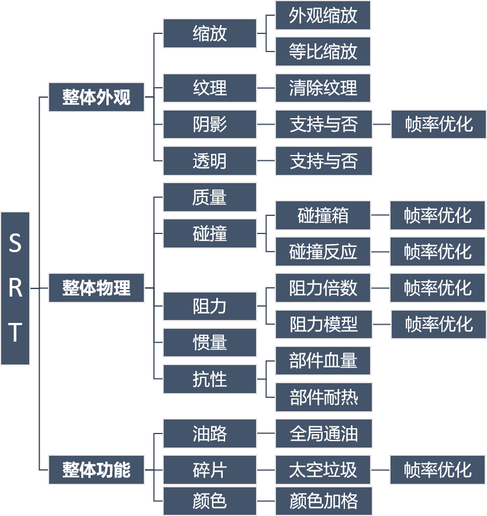

# SRT 工具包

>### **SRT** 即 ***Simple Rockets Tools***
<br>

是一款针对PC平台游戏建造提供的全局部件属性处理工具
<br>

该工具集合了 **外观处理** 、**零件物理**、以及诸如 **颜色方格** 与 **零件油路** 等功能
<br>

具体功能如下图所示：



>完整的功能请[点击此处查看视频演示]()

程序运行目录，请确保您没丢失其中的文件

```
SimpleRocketsTools
├── jre
│   ├── bin
│   │   
│   └── lib
│
└── SRT.exe
```

如果程序在您那边无法运行，请[重新下载](https://github.com/Server-WX/Simple_Rockets_Tools/releases/tag/stable)并解压运行

>如果您的PC上已安装了Java，您可以选择下载不带Jre的版本
